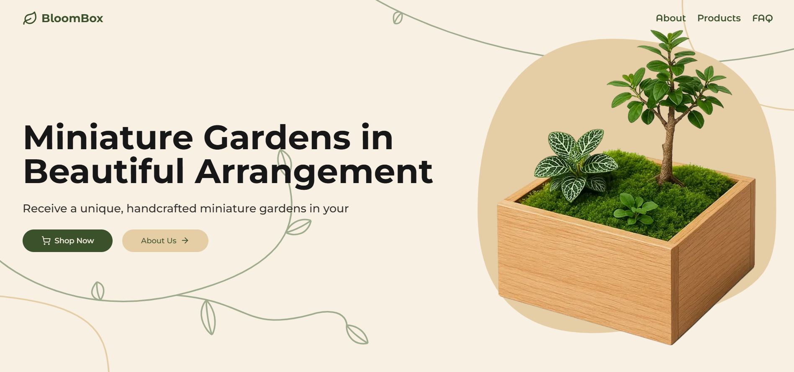
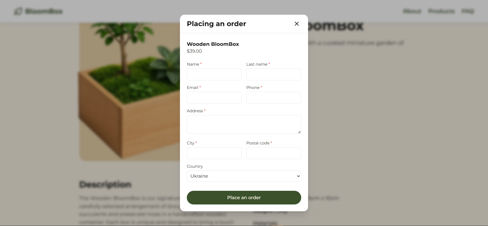

# 🌱 BloomBox — Магазин мініатюрних садів

## 🙌 Автор

Виконала **Ярохмедова Анастасія 11-Г**

---



---

> **BloomBox** — це інноваційний інтернет-магазин, який спеціалізується на продажу мініатюрних садів та рослин. Проект об'єднує красу природи з сучасними технологіями, пропонуючи клієнтам можливість створити свій власний зелений куточок у будь-якому просторі. Магазин пропонує асортимент рослин, аксесуарів та консультацій з догляду, щоб кожен клієнт міг насолоджуватися своїм унікальним садом.

---

## 🔗 Основні посилання

- [🌐 Веб-сайт](https://bloombox-ten.vercel.app)
- [🎨 Figma](https://www.figma.com/design/fm80kwvx5cs5SN2URljNLw/BloomBox--ortlyc-?node-id=0-1&t=Q04XpLjo16Bvuoy2-1)

---

## 🖼️ Приклад інтерфейсу



---

## ✨ Основні можливості

- 🌳 Унікальні мініатюрні сади ручної роботи
- 📦 Зручне онлайн-замовлення
- 💬 Відгуки та консультації
- 🌿 Аксесуари для догляду за рослинами

---

## 🛠️ Технології

- **Node.js 23+**
- **TypeScript**

- **Next.js 14** — фреймворк для React із серверним рендерингом
- **React** — бібліотека для створення UI
- **Tailwind CSS** — сучасний CSS фреймворк
- **SQLite** — база даних для зберігання відгуків
- **Next.js API Routes** — API для обробки запитів
- **Lucide Icons** — бібліотека іконок

---

## 🚀 Початок роботи

1. Встановіть залежності:
    ```bash
    npm install
    ```
2. Зберіть проект:
    ```bash
    npm run build
    ```
3. Запустіть проект:
    ```bash
    npm start
    ```

---

## ⚙️ .env приклад

```env
NODE_ENV=production
RANDOM_REVIEW_DATES=false
```

---

## 👩‍💻 Для розробки

Запуск сервера розробки:
```bash
npm run dev
```

---

## 🚀 Розгортання

Сайт розгорнуто на [Vercel](https://vercel.com), що забезпечує швидке та надійне обладнання для веб-сайту.

---

## 🧩 Труднощі та виклики

### Розробка
- **Інтеграція SQLite**: Налаштування бази даних для зберігання відгуків потребувало додаткового часу на конфігурацію та тестування.
- **Оптимізація продуктивності**: Забезпечення швидкого завантаження сторінок та ефективного використання ресурсів.
- **Синхронізація даних**: Забезпечення коректної роботи з даними між фронтендом та бекендом.
- **Тестування**: Виявлення та виправлення помилок у різних частинах системи.

### Дизайн
- **Адаптивність**: Створення дизайну, який гарно виглядає на всіх пристроях, було складним завданням.
- **Візуальна привабливість**: Пошук балансу між функціональністю та естетикою, щоб забезпечити приємний користувацький досвід.
- **Користувацький інтерфейс**: Розробка інтуїтивно зрозумілого інтерфейсу для користувачів.

